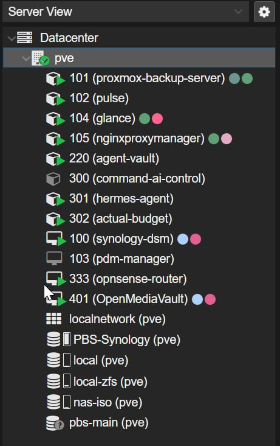
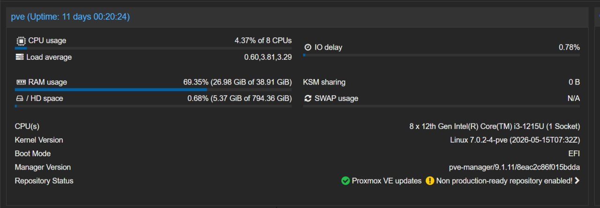
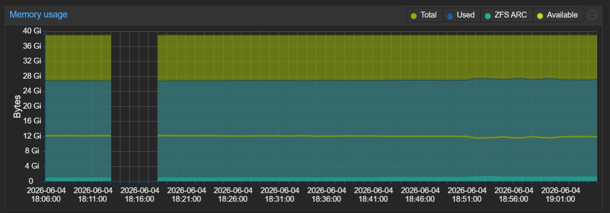
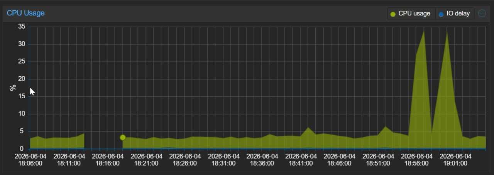
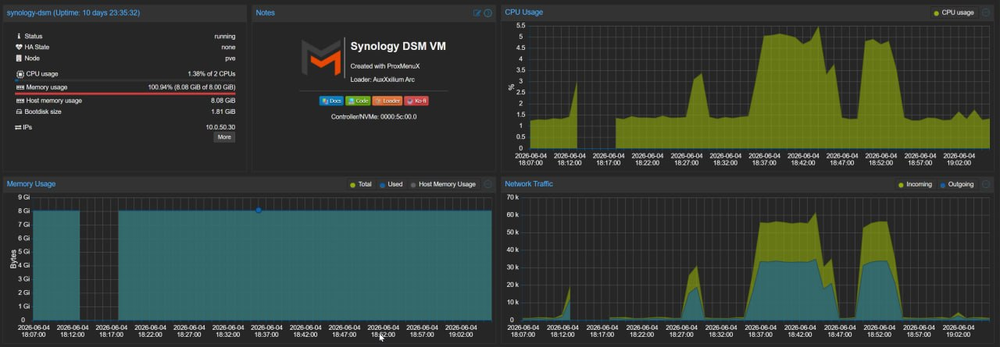
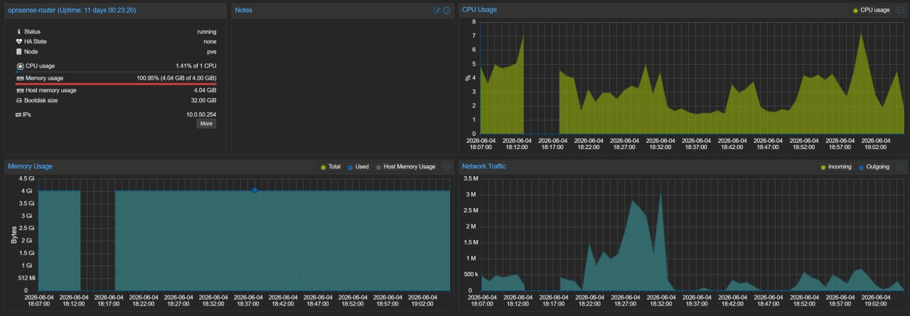

# The ZimaCube Does Not Need More Cores. It Needs More RAM.

A few weeks in, one thing has become painfully obvious.

I was worrying about the wrong number.

When people look at a box like the ZimaCube, the first thing they tend to latch onto is CPU. How many cores? How much headroom? Can it run a few VMs without choking? I used to think the same way. In my head, more VMs meant more cores. Eight, twelve, sixteen, whatever I could get.

Living with this machine has flipped that completely.

If you have read [the Proxmox post](../homelab-journal/proxmox-primary-os.md), you already know I am not using this thing as a cautious little NAS. It is my main Proxmox box. It runs the heavier part of the homelab. And what I keep seeing, over and over again, is that CPU is not the thing under pressure.

RAM is.

## The CPU story is almost boring.

That is the surprise.

Right now I am running ten guests on this box. Three are full VMs. The rest are containers. That includes a Synology VM, Hermes Agent, OPNsense, and the usual small infrastructure bits that quietly keep the house working.

*Caption: This is not a toy setup. The ZimaCube is running ten live guests here, which is exactly why the low CPU usage matters.*

The host is still barely touching the CPU.

On the Proxmox view, I am seeing roughly 3 to 4 per cent CPU usage across the available logical cores. That is with the machine doing real work, not sitting there factory-fresh with one Docker container and a dream.

*Caption: This is the screenshot that changed my mind. Around 4 per cent CPU usage, ten running guests, and still loads of processor headroom left.*

That changes the whole conversation.

If the host is cruising along at 4 per cent while running the setup I described in [Why Proxmox Is the Only OS That Makes Sense](../homelab-journal/proxmox-primary-os.md), then the "I need loads of cores for four VMs" mindset starts to fall apart a bit. Most of the time, I do not.

Most of the time, one or two vCPUs per guest is plenty.

That has been the actual lived experience.

## The RAM story is a different beast.

This is where the box starts telling the truth.

Mine has 40GB of RAM now. The stock 8GB stick was never going to last, which I already said in [Would I Buy the ZimaCube 2 With My Own Money?](../hardware/would-i-buy-it.md). Back then, that was more of a pricing argument. Now it is a usage argument.

I am currently using about 27GB.

*Caption: This is the real story. The memory graph stays high and steady because the workloads keep living there, even when the CPU is barely awake.*

That is not a weird benchmark run. That is not a stress test. That is just the machine existing as my real homelab host, twenty four seven, doing the jobs I actually want it to do.

And that is the number that matters.

CPU headroom looks great on a product page. Memory headroom is what keeps the machine comfortable once you start stacking VMs, LXCs, background services, caches, and all the little bits of infrastructure that never really switch off.

Virtualisation also has a habit of making RAM feel messier than it looks on paper. Guest reporting is not always perfect. QEMU guest agents do not always behave. Usage drifts. Allocations add up. You can absolutely get away with being light on cores for a while. Being light on memory is where the pain starts.

*Caption: The CPU graph tells the opposite story to the RAM graph. A couple of spikes, sure, but most of the time this host is barely touching the processor.*

## This is why the stock configuration annoys me.

I do not think 8GB gives this machine its best first impression.

That might sound harsh, but I think it is true.

The ZimaCube is not cheap. It is also not absurd for what you get. Six drive bays. Four front NVMe slots. Two more motherboard NVMe slots. Compact chassis. Easy RAM access, which I showed in the [disassembly post](../hardware/disassembly.md). Dual 2.5 gigabit on the Standard. Thunderbolt. PCIe. It is an attractive bit of hardware.

The problem is that the default memory spec undersells the whole point of it.

Anyone buying this machine is probably buying it for one of two reasons:

- they want a serious storage box with room to grow
- they want a compact homelab server that can do more than NAS duty

In both cases, 8GB feels mean.

If all you want is a cheap box to expand your home lab, there are cheaper ways to do that. Much cheaper. That is part of the argument I already made in [the original price breakdown](../hardware/would-i-buy-it.md). A box like this gets attention because it offers a lot in one chassis. Storage density. Fast storage. Nice I/O. Expandability. It is a premium-ish product.

Shipping it with 8GB of RAM feels like putting budget tyres on a car you are trying to sell on handling.

Technically it works.

It also misses the point.

## The machine sits in a weird middle ground.

This is the part I keep coming back to.

If you leave it on [ZimaOS](../homelab-journal/zimaos-review.md), the stock configuration makes a bit more sense. A few Docker containers, file shares, basic NAS jobs, maybe some light office use. Fine. That is a valid product.

The hardware is better than that.

That is the tension.

I said earlier in the blog that the ZimaCube feels like a proper little server pretending to be a plug and play NAS. I still think that. The BIOS depth, the PCIe options, the storage layout, the way it opens up once you put [Proxmox](../homelab-journal/proxmox-primary-os.md) on it. None of that says "please just run a couple of apps and a share."

It says "give me real jobs."

Once you do that, RAM becomes the first honest bottleneck.

That is why I am more forgiving of limited core count than limited memory now. The CPU is loafing around most of the day. The RAM is what gets eaten by the shape of the workload.

*Caption: Even the heavier guests are not hammering CPU all day. What they do hold onto is memory, and that adds up fast across a Proxmox host.*

*Caption: Same story with OPNsense. Light CPU demand, but the RAM stays spoken for. That is what turns memory into the real planning number.*

## If IceWhale changed one thing, this would be it.

I would rather see one of two options.

- a more honest default with 16GB minimum
- a true barebones version at a lower entry price

Sixteen gigs would still not be luxurious. I would still tell most people to aim for 32GB if they plan to virtualise properly. But 16GB at least gets you out of the "I need to upgrade this immediately" territory.

The barebones route is the other answer.

Sell the chassis, board, CPU, and expansion story for less money. Let people choose their own RAM and storage from day one. I understand why that is awkward when you want a polished out-of-box ZimaOS experience. I understand why preloading the OS matters.

I just do not think the current compromise gives the buyer maximum value.

If you are shipping a machine that invites people to dream a little bigger, the memory spec should match the dream.

## My honest take

The RAM versus core count debate is not even a debate for me anymore.

RAM wins.

Not because CPU does not matter at all. It does. If you are running heavy Windows VMs, transcoding workloads, or doing something genuinely compute-hungry, more CPU is still useful. I am not pretending otherwise.

Yet for the way I am actually using the ZimaCube, CPU is not the wall.

Memory is.

The stock 8GB configuration does not match what this machine wants to be. If you are buying a ZimaCube to use the six bays, the NVMe slots, and the virtualisation headroom properly, 8GB is not a serious starting point. In my opinion, 16GB should be the floor and 32GB is where the machine starts to feel right.

That is the lesson this box has taught me.

I went in thinking I needed more cores.

I came out realising I needed more RAM.

---

**Related Posts:**
- [Would I Buy the ZimaCube 2 With My Own Money?](../hardware/would-i-buy-it.md) — the price argument that started this whole RAM complaint
- [Why Proxmox Is the Only OS That Makes Sense](../homelab-journal/proxmox-primary-os.md) — the actual setup this RAM usage is coming from
- [ZimaOS: Good at What It Does, Just Not for This](../homelab-journal/zimaos-review.md) — why the stock software never felt like the best match for the hardware
- [Inside the ZimaCube](../hardware/disassembly.md) — the easy RAM access and the physical upgrade path
- [Six Weeks With the ZimaCube 2](../hardware/six-weeks-later.md) — where the early signs of this started showing up

*Written: June 2026*